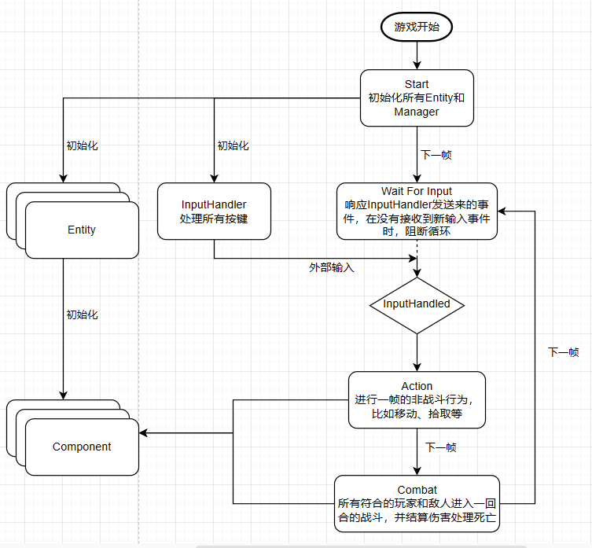

# ANY

最后编写:`2023-11-18` `怨气滔天`

本笔记用于记录NetHackLike游戏的开发过程

## 目录规划


```
NetHackLike
├─ assets                                 //用于存放所有外部资源文件夹，比如声音、图像、字体
│  └─ textures
│     ├─ quale's_spritesheet.png
│     ├─ quale's_spritesheet.png.import
│     ├─ tile_sheet.png
│     ├─ tile_sheet.png.import
│     ├─ vonwaon_bitmap_16px.ttf
│     └─ vonwaon_bitmap_16px.ttf.import
├─ components                             //component表示Entity可用的最小功能集合
│  ├─ IComponent.cs
│  └─ movement_component                     //用于存放移动用的组件
│     ├─ MovementComponent.cs
│     └─ movement_component.tscn
├─ entities                               //用于存放实体，表示场景中所有可见对象，比如玩家敌人、掉落物和装备
│  ├─ characters                             //所有角色都属于character
│  │  ├─ Character.cs
│  │  ├─ character.tscn
│  │  ├─ enemy                                  //敌人
│  │  │  ├─ Enemy.cs
│  │  │  ├─ enemy.tscn
│  │  │  ├─ goblin
│  │  │  │  └─ goblin.tscn
│  │  │  ├─ orc
│  │  │  │  └─ orc.tscn
│  │  │  ├─ rat
│  │  │  │  └─ rat.tscn
│  │  │  ├─ skeleton
│  │  │  │  └─ skeleton.tscn
│  │  │  ├─ skeleton_king
│  │  │  │  └─ skeleton_king.tscn
│  │  │  └─ skeleton_magician
│  │  │     └─ skeleton_magician.tscn
│  │  └─ player                                 //玩家
│  │     ├─ Player.cs
│  │     └─ player.tscn
│  └─ IEntity.cs
├─ managers                               //宏观且抽象的某类功能的集合，通常可以直接批量或单独操作特定的Entity
│  ├─ enemy_spawner
│  │  ├─ EnemySpawner.cs
│  │  └─ enemy_spawner.tscn
│  ├─ fsm                                    //用于存放有限状态机
│  │  ├─ Fsm.cs
│  │  ├─ fsm.tscn
│  │  └─ game_states
│  │     ├─ action_state
│  │     │  ├─ ActionState.cs
│  │     │  └─ action_state.tscn
│  │     ├─ combat_state
│  │     │  ├─ CombatState.cs
│  │     │  └─ combat_state.tscn
│  │     ├─ IGameState.cs
│  │     ├─ start_state
│  │     │  ├─ StartState.cs
│  │     │  └─ start_state.tscn
│  │     └─ wait_for_input_state
│  │        ├─ WaitForInputState.cs
│  │        └─ wait_for_input_state.tscn
│  ├─ IManager.cs
│  ├─ input_handler
│  │  ├─ InputHandler.cs
│  │  └─ input_handler.tscn
│  └─ map_manager                          //用来存放地图管理器和各类地图生成器
│     ├─ MapManager.cs
│     ├─ map_generators                      //各类型地图的生成器
│     │  ├─ dungeon_generator                    //地牢地图的生成器
│     │  │  ├─ DungeonGenerator.cs
│     │  │  └─ dungeon_generator.tscn
│     │  └─ IMapGenerator.cs
│     └─ map_manager.tscn
├─ resources                              //用来存放Godot Resource的资源
│  ├─ map_data
│  │  ├─ dungeon_data
│  │  │  ├─ DungeonData.cs
│  │  │  └─ dungeon_data.tres
│  │  └─ MapData.cs
│  └─ tile_sets
│     └─ dungeon_tile_set.tres
└─ scenes
   ├─ Main.cs
   └─ main.tscn

```


## 状态循环


